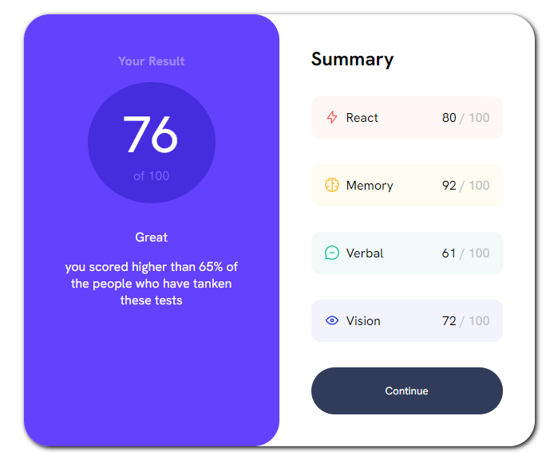
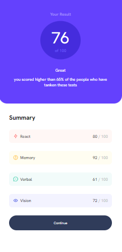

<h1 align="center"> Human Potential</h1>

Primeiro site desenvolvido do 0 sem ajuda

  <a href="https://human-potential.vercel.app/" > Veja como Ficou</a>

  

 

  
  
  

## 🚀 Tecnologias

Esse projeto foi desenvolvido com as seguintes tecnologias:

- HTML e CSS

## 💻 Projeto

O human potential é um projeto desenvolvido como forma de aprendizagem para revisar conceitos de HTML E CSS. Esse projeto teve como base de design um dos desavios do front end mentor.

Esse projeto está sob a licença MIT.

---
